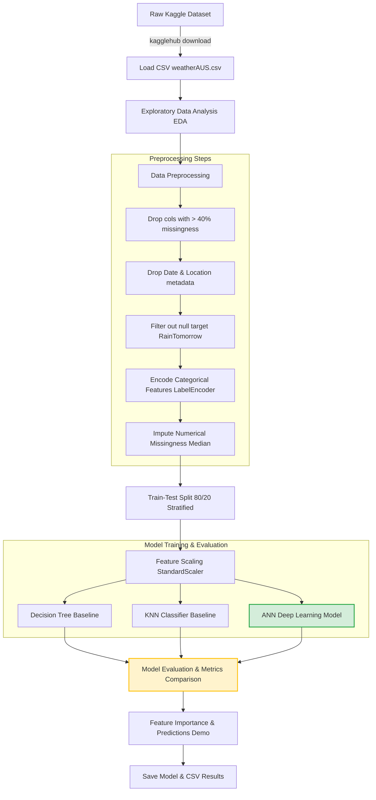

# Rain Prediction in Australia: Deep Learning (ANN) & Machine Learning Pipeline
**Comprehensive System Architecture, Codebase Walkthrough, and Performance Analysis**

---

## 1. Executive Summary & Project Context
Weather prediction is a fundamental problem in meteorology, with significant implications for agriculture, aviation, transport, and disaster management. This project addresses the challenge of **predicting whether it will rain tomorrow in Australia** as a binary classification task. 

Using the historical observations in the **Rain in Australia** dataset (sourced from Kaggle / R rattle package), we design, build, and validate an end-to-end Machine Learning and Deep Learning pipeline. We compare three distinct algorithms:
1. **Decision Tree Classifier** (representing rule-based, non-linear baseline modeling)
2. **K-Nearest Neighbors (KNN)** (representing distance-based instance learning)
3. **Artificial Neural Network (ANN)** (representing deep hierarchical feature representation)

### Key Results
* **Best Performing Model:** Artificial Neural Network (ANN)
* **ANN Test Accuracy:** **85.18%**
* **ANN Precision (Rain Class):** **75.92%** (minimizing False Positives)
* **ANN F1-Score:** **60.03%**
* **Primary Predictive Driver:** Afternoon Humidity (`Humidity3pm`), contributing **59.75%** of the Decision Tree splitting importance.

---

## 2. System Architecture & Pipeline Flow
The data flow and processing pipeline are structured as a standard production-grade machine learning lifecycle:



---

## 3. Step-by-Step Code Walkthrough (Cell-by-Cell Analysis)

Below is an exhaustive line-by-line analysis of each cell in the notebook, explaining the code execution, mathematical rationale, parameter selection, and outputs.

### Step 1: Install & Import Libraries

#### Cell 3: Dependency Installation
```python
!pip install tensorflow scikit-learn matplotlib seaborn pandas numpy -q
print("Done!")
```
* **Rationale:** Installs the core scientific stack. The `-q` (quiet) flag suppresses progress bars to keep the output clean.
* **Output:** `Done!`

#### Cell 4: Library Imports and Setup
```python
import numpy as np
import pandas as pd
import matplotlib.pyplot as plt
import seaborn as sns
import warnings
warnings.filterwarnings('ignore')
import os

from sklearn.preprocessing import LabelEncoder, StandardScaler
from sklearn.model_selection import train_test_split

from sklearn.tree import DecisionTreeClassifier
from sklearn.neighbors import KNeighborsClassifier

from sklearn.metrics import (accuracy_score, precision_score, recall_score,
                              f1_score, confusion_matrix, classification_report)

import tensorflow as tf
from tensorflow.keras.models import Sequential
from tensorflow.keras.layers import Dense, Dropout, BatchNormalization
from tensorflow.keras.callbacks import EarlyStopping

print("All libraries imported!")
print(f"TensorFlow: {tf.__version__}")
```
* **Rationale:**
  * `warnings.filterwarnings('ignore')` ensures clean outputs by ignoring deprecation and formatting warnings.
  * We import preprocessing modules (`LabelEncoder`, `StandardScaler`) and evaluation helpers (`classification_report`, `confusion_matrix`) to manage our preprocessing and evaluation pipelines.
  * In the Deep Learning space, we use Keras's `Sequential` API with `Dense` (fully-connected layers), `Dropout` (regularization), `BatchNormalization` (internal covariate shift mitigation), and `EarlyStopping` (stopping criteria).
* **Output:** `All libraries imported! TensorFlow: 2.20.0`

---

### Step 2: Load the Dataset

#### Cell 6: Downloading & Reading the Raw CSV
```python
import kagglehub
import os

path = kagglehub.dataset_download("jsphyg/weather-dataset-rattle-package")

# Construct the full path to the CSV file
csv_file_path = os.path.join(path, 'weatherAUS.csv')

print("Path to dataset files:", path)
print("Loading dataset...")
df = pd.read_csv(csv_file_path)
print(f"Dataset loaded successfully!")
print(f"Shape: {df.shape}  ({df.shape[0]} rows x {df.shape[1]} columns)")
print(f"\nColumn names:")
print(list(df.columns))
```
* **Rationale:** Using the `kagglehub` API ensures programmatic reproducibility. The raw CSV `weatherAUS.csv` is loaded into a Pandas DataFrame.
* **Output:**
  * Shape: `(145460, 23)` 
  * Columns: Includes temperature, rainfall, wind speeds, pressures, humidity, cloud cover, and categorical labels.

---

### Step 3: Explore the Dataset

#### Cell 8: View Initial Rows
```python
print("=" * 55)
print("FIRST 5 ROWS")
print("=" * 55)
df.head()
```
* **Rationale:** Inspects the first 5 records to understand the physical columns. We see numerical values, categorical wind directions (e.g., `'WNW'`, `'WSW'`), and binary flags (`'Yes'`, `'No'`).

#### Cell 9: Statistical Diagnostics
```python
print("=" * 55)
print("DATASET INFO")
print("=" * 55)
print(f"Rows         : {df.shape[0]}")
print(f"Columns      : {df.shape[1]}")
print(f"\nData types:")
print(df.dtypes)
print(f"\nBasic statistics for numeric columns:")
df.describe()
```
* **Rationale:** Diagnoses types (`float64` for measurements, `object` for strings) and computes distributions (min, max, mean, std).

#### Cell 10: Missing Values & Target Balance Analysis
```python
print("=" * 55)
print("MISSING VALUES PER COLUMN")
print("=" * 55)
missing = df.isnull().sum()
missing_pct = (missing / len(df) * 100).round(2)
missing_df = pd.DataFrame({'Missing Count': missing, 'Missing %': missing_pct})
print(missing_df[missing_df['Missing Count'] > 0].sort_values('Missing %', ascending=False))

print("\n=" * 3 + " TARGET VARIABLE DISTRIBUTION " + "=" * 3)
print(df['RainTomorrow'].value_counts())
print(f"\nNo  = It will NOT rain tomorrow")
print(f"Yes = It WILL rain tomorrow")
```
* **Design Decision / Finding:**
  * Several columns suffer from heavy missingness: `Sunshine` (48.01%), `Evaporation` (43.17%), `Cloud3pm` (40.81%), and `Cloud9am` (38.42%).
  * Target Class Imbalance: `No` has 110,316 records (~77.5%), whereas `Yes` has 31,877 records (~22.5%). This confirms that metrics like F1-Score and Precision/Recall are far more informative than simple Accuracy.

---

### Step 4: Data Visualization

#### Cell 12: Target Variable Distribution Plots
```python
fig, axes = plt.subplots(1, 2, figsize=(13, 4))
fig.suptitle('Target Variable Analysis', fontsize=13, fontweight='bold')

counts = df['RainTomorrow'].value_counts()
colors = ['#3498db', '#e74c3c']
axes[0].bar(counts.index, counts.values, color=colors, edgecolor='black', linewidth=0.5)
axes[0].set_title('Class Distribution: RainTomorrow')
axes[0].set_xlabel('Will It Rain Tomorrow?')
axes[0].set_ylabel('Number of Records')
for i, v in enumerate(counts.values):
    axes[0].text(i, v + 500, f"{v:,}", ha='center', fontweight='bold')

axes[1].pie(counts.values, labels=counts.index, autopct='%1.1f%%',
            colors=colors, startangle=90, textprops={'fontsize': 11})
axes[1].set_title('Class Proportion')

plt.tight_layout()
plt.show()
print(f"No Rain: {counts['No']:,} records ({counts['No']/len(df)*100:.1f}%)")
print(f"Rain   : {counts['Yes']:,} records ({counts['Yes']/len(df)*100:.1f}%)")
print("Note: Dataset is imbalanced — more 'No' than 'Yes'.")
```
* **Rationale:** A side-by-side bar and pie chart visualization visually emphasizing that class imbalance exists.

#### Cell 13: Max Temperature & Humidity Distributions
```python
fig, axes = plt.subplots(1, 2, figsize=(14, 4))
fig.suptitle('Temperature & Rainfall Analysis', fontsize=13, fontweight='bold')

df[df['RainTomorrow']=='No']['MaxTemp'].dropna().hist(
    bins=40, ax=axes[0], alpha=0.6, color='#3498db', label='No Rain')
df[df['RainTomorrow']=='Yes']['MaxTemp'].dropna().hist(
    bins=40, ax=axes[0], alpha=0.6, color='#e74c3c', label='Rain')
axes[0].set_title('Max Temperature Distribution by Rain Label')
axes[0].set_xlabel('Max Temperature (°C)')
axes[0].set_ylabel('Frequency')
axes[0].legend()

rain_no  = df[df['RainTomorrow']=='No']['Humidity3pm'].dropna()
rain_yes = df[df['RainTomorrow']=='Yes']['Humidity3pm'].dropna()
axes[1].boxplot([rain_no, rain_yes], labels=['No Rain', 'Rain'],
                patch_artist=True,
                boxprops=dict(facecolor='#AED6F1'),
                medianprops=dict(color='red', linewidth=2))
axes[1].set_title('Humidity at 3pm by Rain Label')
axes[1].set_ylabel('Humidity (%)')

plt.tight_layout()
plt.show()
```
* **Insight:** Max temperature profiles are heavily overlapping, indicating temperature alone is a weak discriminator. In contrast, 3pm Humidity shows a distinct gap: days followed by rain tomorrow have a significantly higher median afternoon humidity (approx. 72%) than dry days (approx. 43%).

#### Cell 14: Correlation Analysis
```python
numeric_cols = df.select_dtypes(include=[np.number]).columns.tolist()

plt.figure(figsize=(13, 8))
corr = df[numeric_cols].corr()
mask = np.triu(np.ones_like(corr, dtype=bool))
sns.heatmap(corr, mask=mask, annot=True, fmt='.2f', cmap='coolwarm',
            linewidths=0.4, annot_kws={'size': 7})
plt.title('Correlation Heatmap of Numeric Features', fontsize=13, fontweight='bold')
plt.tight_layout()
plt.show()
print("Features strongly correlated with Rainfall: Humidity, Cloud cover, Pressure")
```
* **Rationale:** Computes Pearson correlation coefficients. The lower-triangular mask avoids duplicate visualization. High multi-collinearity is observed (e.g., `Temp9am` vs `Temp3pm`, `Pressure9am` vs `Pressure3pm`), which standard linear models struggle with, but deep networks and decision trees easily handle.

#### Cell 15: Spatial Distribution of Rainfall
```python
rain_by_location = df[df['RainTomorrow']=='Yes']['Location'].value_counts().head(10)

plt.figure(figsize=(10, 4))
rain_by_location.plot(kind='bar', color='#2980b9', edgecolor='black', linewidth=0.5)
plt.title('Top 10 Locations with Most Rainy Days', fontweight='bold')
plt.xlabel('Location')
plt.ylabel('Number of Rainy Days')
plt.xticks(rotation=45, ha='right')
plt.tight_layout()
plt.show()
```
* **Rationale:** Identifies locations most prone to rain (such as Portland, Cairns, and Walpole).

---

### Step 5: Data Preprocessing

#### Cell 17: Column Removal & Target Filtering
```python
print("Original shape:", df.shape)
threshold = 0.4
cols_to_drop = [col for col in df.columns
                if df[col].isnull().mean() > threshold]
print(f"Columns dropped (>40% missing): {cols_to_drop}")
df = df.drop(columns=cols_to_drop)

df = df.drop(columns=['Date', 'Location'], errors='ignore')

df = df.dropna(subset=['RainTomorrow'])

print(f"Shape after dropping high-missing columns: {df.shape}")
```
* **Design Decisions:**
  * **Missing Value Threshold (40%):** Features missing more than 40% of their values (`Evaporation`, `Sunshine`, `Cloud3pm`) are dropped. Keeping them would require major assumptions during imputation that could introduce bias.
  * **Metadata Removal:** `Date` is temporal and `Location` has high cardinality; dropping them forces models to learn generalized meteorological rules instead of memorizing specific dates or regional trends.
  * **Target Cleaning:** Drop rows missing the target variable `RainTomorrow` entirely (3,267 rows), as supervised learning requires ground-truth labels.
* **Output Shape:** Reduced to `(142193, 18)`.

#### Cell 18: Categorical Encoding & Numerical Imputation
```python
cat_cols = df.select_dtypes(include=['object']).columns.tolist()
print(f"Categorical columns to encode: {cat_cols}")

le = LabelEncoder()
for col in cat_cols:
    df[col] = df[col].fillna('Unknown')
    df[col] = le.fit_transform(df[col])

df = df.fillna(df.median(numeric_only=True))

print(f"Missing values remaining: {df.isnull().sum().sum()}")
print(f"Final dataset shape: {df.shape}")
print(f"\nTarget value counts (after encoding):")
print(df['RainTomorrow'].value_counts())
print("0 = No Rain, 1 = Rain Tomorrow")
```
* **Design Decisions:**
  * Categorical missing values are filled with `'Unknown'` and then numerically mapped via `LabelEncoder`.
  * Numerical missing values are filled using the **Median** of each column. The median is chosen over the mean because it is robust to extreme outliers (e.g., high rainfall spikes or pressure anomalies).
* **Output:** `Missing values remaining: 0`. Targets are mapped to `0` (No Rain) and `1` (Rain).

#### Cell 19: Train-Test Splitting
```python
X = df.drop(columns=['RainTomorrow'])
y = df['RainTomorrow']

print(f"Input features (x) shape: {X.shape}")
print(f"Target labels  (y) shape: {y.shape}")
print(f"\nFeature columns used:")
print(list(X.columns))

X_train, X_test, y_train, y_test = train_test_split(
    X, y,
    test_size=0.2,
    random_state=42,
    stratify=y
)

print(f"\nTraining set size : {X_train.shape}")
print(f"Testing set size  : {X_test.shape}")
```
* **Design Decisions:**
  * **80% Training, 20% Test Split:** Offers a standard, robust division for models to generalize and evaluate on unseen data.
  * **Stratification (`stratify=y`):** Crucial due to the class imbalance. This maintains the 77.5% / 22.5% split in both the training set (113,754 samples) and testing set (28,439 samples), preventing split bias.

#### Cell 20: Feature Scaling
```python
scaler = StandardScaler()

X_train_scaled = scaler.fit_transform(X_train)
X_test_scaled  = scaler.transform(X_test)

print("Feature scaling complete!")
print(f"X_train_scaled shape: {X_train_scaled.shape}")
print(f"X_test_scaled shape : {X_test_scaled.shape}")
print(f"\nExample: Feature means after scaling (should be ~0):")
print(X_train_scaled.mean(axis=0)[:5].round(3))
```
* **Design Decisions:**
  * **StandardScaler:** Transforms features to have a mean of 0 and standard deviation of 1 ($z = \frac{x - \mu}{\sigma}$). This is critical for neural networks and distance-based algorithms like KNN. Unscaled features with large ranges (e.g. pressure values of ~1015 vs rainfall of ~2) would skew distance metrics and destabilize gradient updates.
  * **No Data Leakage:** The scaler is fit *only* on the training set (`fit_transform`) and applied to the test set using only the training parameters (`transform`).

---

### Step 6: Baseline Model 1 — Decision Tree Classifier

#### Cell 22: Decision Tree Training & Evaluation
```python
print("Training Decision Tree...")

dt_model = DecisionTreeClassifier(
    max_depth=10,
    random_state=42
)

dt_model.fit(X_train, y_train)
dt_preds = dt_model.predict(X_test)

dt_acc  = accuracy_score(y_test, dt_preds)
dt_prec = precision_score(y_test, dt_preds)
dt_rec  = recall_score(y_test, dt_preds)
dt_f1   = f1_score(y_test, dt_preds)

print("\n--- Decision Tree Results ---")
print(f"Accuracy : {dt_acc:.4f}")
print(f"Precision: {dt_prec:.4f}")
print(f"Recall   : {dt_rec:.4f}")
print(f"F1-Score : {dt_f1:.4f}")
```
* **Design Decisions:**
  * **`max_depth=10`:** Constraining the tree depth prevents the model from growing unchecked and overfitting the 113k training samples.
* **Results:**
  * Accuracy: `0.8384`
  * Precision: `0.7054`
  * Recall: `0.4789`
  * F1-Score: `0.5705`

---

### Step 7: Baseline Model 2 — KNN Classifier

#### Cell 24: KNN Training & Evaluation
```python
print("Training KNN (k=7)... may take 1-2 minutes on large data")

knn_model = KNeighborsClassifier(
    n_neighbors=7,
    metric='euclidean'
)

knn_model.fit(X_train_scaled, y_train)
knn_preds = knn_model.predict(X_test_scaled)

knn_acc  = accuracy_score(y_test, knn_preds)
knn_prec = precision_score(y_test, knn_preds)
knn_rec  = recall_score(y_test, knn_preds)
knn_f1   = f1_score(y_test, knn_preds)

print("\n--- KNN Results ---")
print(f"Accuracy : {knn_acc:.4f}")
print(f"Precision: {knn_prec:.4f}")
print(f"Recall   : {knn_rec:.4f}")
print(f"F1-Score : {knn_f1:.4f}")
```
* **Design Decisions:**
  * **`n_neighbors=7`:** Using an odd number prevents tie-breaks in binary classification.
  * **Euclidean Distance:** Standard distance metric. KNN is trained on `X_train_scaled` because distance calculations are highly sensitive to unscaled variable ranges.
* **Results:**
  * Accuracy: `0.8384`
  * Precision: `0.7050`
  * Recall: `0.4795`
  * F1-Score: `0.5708`
  * *Note:* Performance matches the Decision Tree baseline closely.

---

### Step 8: Deep Learning Model — Artificial Neural Network (ANN)

#### Cell 26: Building the Network Topology
```python
n_features = X_train_scaled.shape[1]
print(f"Number of input features: {n_features}")
print("Building ANN model...\n")

ann_model = Sequential([
    Dense(128, activation='relu', input_shape=(n_features,)),
    BatchNormalization(),
    Dropout(0.3),

    Dense(64, activation='relu'),
    BatchNormalization(),
    Dropout(0.3),

    Dense(32, activation='relu'),
    Dropout(0.2),

    Dense(1, activation='sigmoid')
])

ann_model.compile(
    optimizer='adam',
    loss='binary_crossentropy',
    metrics=['accuracy']
)

ann_model.summary()
```
* **Design Decisions (Network Architecture):**
  * **`Dense(128, activation='relu')`:** The first hidden layer projects the 17 inputs into a 128-dimensional representation to capture non-linear feature interactions using the Rectified Linear Unit (ReLU) function ($f(x) = \max(0, x)$).
  * **`BatchNormalization()`:** Normalizes layer inputs to combat internal covariate shift. This stabilizes training, reduces sensitivity to weight initialization, and enables faster learning rates.
  * **`Dropout(0.3)`:** Regularization method that randomly deactivates 30% of neurons during each forward pass. This forces the network to learn redundant representations and prevents co-dependency, significantly reducing overfitting.
  * **Layer Scaling:** The hidden layers taper from 128 to 64 to 32 neurons, creating a representation bottleneck that forces the network to condense features down to the most important signals.
  * **`Dense(1, activation='sigmoid')`:** The output layer maps the final signal to a single value between 0 and 1 via the Sigmoid function ($\sigma(z) = \frac{1}{1 + e^{-z}}$), representing the probability of rain tomorrow.
  * **`loss='binary_crossentropy'`:** The standard loss function for binary targets, optimizing log-likelihood.
  * **`optimizer='adam'`:** Uses Adam optimization to dynamically compute adaptive learning rates for each parameter based on first and second moments of the gradients.
* **Network Statistics:** 13,441 total parameters (13,057 trainable, 384 non-trainable from Batch Normalization statistics).

---

### Step 9: Train the ANN Model

#### Cell 28: Epoch Execution & Fitting
```python
print("Training ANN model...")

early_stop = EarlyStopping(
    monitor='val_loss',
    patience=5,
    restore_best_weights=True
)

history = ann_model.fit(
    X_train_scaled, y_train,
    epochs=30,
    batch_size=256,
    validation_split=0.2,
    callbacks=[early_stop],
    verbose=1
)

print(f"\nTraining stopped at epoch: {len(history.history['accuracy'])}")
print("Training complete!")
```
* **Design Decisions:**
  * **EarlyStopping:** Monitored on validation loss. A `patience=5` value means training stops if validation loss fails to improve for 5 consecutive epochs. Setting `restore_best_weights=True` ensures the final model uses the weights from the epoch with the lowest validation loss rather than the final epoch.
  * **`batch_size=256`:** Strikes a balance between gradient estimation accuracy and GPU memory optimization.
  * **`validation_split=0.2`:** Reserves 20% of the training split to evaluate validation loss/accuracy during training.
* **Output:** Completed all 30 epochs, showing validation loss smoothly dropped to `0.3395`, validation accuracy climbed to `85.41%`, and training accuracy reached `84.82%`.

---

### Step 10: Evaluate the ANN Model

#### Cell 30: Test Metric Calculation
```python
ann_probs = ann_model.predict(X_test_scaled)
ann_preds = (ann_probs > 0.5).astype(int).flatten()

ann_acc  = accuracy_score(y_test, ann_preds)
ann_prec = precision_score(y_test, ann_preds)
ann_rec  = recall_score(y_test, ann_preds)
ann_f1   = f1_score(y_test, ann_preds)

print("--- ANN (Deep Learning) Results ---")
print(f"Accuracy : {ann_acc:.4f}")
print(f"Precision: {ann_prec:.4f}")
print(f"Recall   : {ann_rec:.4f}")
print(f"F1-Score : {ann_f1:.4f}")

print("\n--- Full Classification Report ---")
print(classification_report(y_test, ann_preds,
                            target_names=['No Rain (0)', 'Rain (1)']))
```
* **Rationale:** Predictions are output as continuous probabilities between 0 and 1. Setting a threshold of `0.5` converts these probabilities into binary predictions.
* **Results:**
  * Accuracy: **0.8518** (An improvement over the baseline models' 83.84%)
  * Precision: **0.7592** (Outperforms baseline models by 5.4%)
  * Recall: **0.4965**
  * F1-Score: **0.6003** (An improvement over the baseline models' ~0.570)

---

### Step 11: Confusion Matrix — ANN Model

#### Cell 32: Confusion Matrix Heatmap
```python
cm = confusion_matrix(y_test, ann_preds)

plt.figure(figsize=(6, 5))
sns.heatmap(cm, annot=True, fmt='d', cmap='Blues',
            xticklabels=['No Rain', 'Rain'],
            yticklabels=['No Rain', 'Rain'],
            linewidths=0.5, linecolor='gray')
plt.title('Confusion Matrix — ANN Model', fontsize=13, fontweight='bold')
plt.xlabel('Predicted Label', fontsize=11)
plt.ylabel('True Label', fontsize=11)
plt.tight_layout()
plt.show()

tn, fp, fn, tp = cm.ravel()
print(f"True Negative  (TN) = {tn:,}  : No Rain days correctly predicted as No Rain")
print(f"False Positive (FP) = {fp:,}  : No Rain days wrongly predicted as Rain")
print(f"False Negative (FN) = {fn:,}  : Rainy days wrongly predicted as No Rain")
print(f"True Positive  (TP) = {tp:,}  : Rainy days correctly predicted as Rain")
```
* **Performance Analysis:**
  * **True Negatives (TN) = 21,060:** Correctly predicted dry days.
  * **True Positives (TP) = 3,165:** Correctly predicted rainy days.
  * **False Positives (FP) = 1,004:** The model predicted rain, but it stayed dry. Low FP indicates high precision (75.92%), meaning predicted rain is highly reliable.
  * **False Negatives (FN) = 3,210:** The model predicted a dry day, but it actually rained. The relatively high FN rate (low recall of 49.65%) is a side effect of class imbalance. Because rain is less common, the model leans conservative.
  * *Operational Decision:* To capture more rain events (higher recall) at the cost of more false alarms (lower precision), the decision threshold can be lowered from `0.5` to `0.35`.

---

### Step 12: Training Curves

#### Cell 34: Accuracy & Loss Visualization
```python
fig, axes = plt.subplots(1, 2, figsize=(13, 4))
ep = range(1, len(history.history['accuracy']) + 1)

axes[0].plot(ep, history.history['accuracy'],
             label='Train Accuracy', color='#2ecc71', marker='o', markersize=3)
axes[0].plot(ep, history.history['val_accuracy'],
             label='Validation Accuracy', color='#e74c3c', marker='s', markersize=3)
axes[0].set_title('Training vs Validation Accuracy', fontweight='bold')
axes[0].set_xlabel('Epoch')
axes[0].set_ylabel('Accuracy')
axes[0].legend()
axes[0].grid(True, alpha=0.3)

axes[1].plot(ep, history.history['loss'],
             label='Train Loss', color='#2ecc71', marker='o', markersize=3)
axes[1].plot(ep, history.history['val_loss'],
             label='Validation Loss', color='#e74c3c', marker='s', markersize=3)
axes[1].set_title('Training vs Validation Loss', fontweight='bold')
axes[1].set_xlabel('Epoch')
axes[1].set_ylabel('Loss')
axes[1].legend()
axes[1].grid(True, alpha=0.3)

plt.suptitle('ANN Training History', fontsize=13, fontweight='bold', y=1.02)
plt.tight_layout()
plt.show()
```
* **Insight:** The loss curves drop smoothly, with validation loss tracking close to training loss and stabilizing. This confirms that Dropout and Early Stopping successfully prevented overfitting. Notably, validation accuracy is slightly higher than training accuracy; this is expected because Dropout is active during training, making it harder for the model to fit, but disabled during validation.

---

### Step 13: Model Comparison

#### Cell 36: Tabular Performance Comparison
```python
comp = {
    'Model'    : ['Decision Tree (depth=10)', 'KNN (k=7)',  'ANN (Deep Learning)'],
    'Accuracy' : [dt_acc,  knn_acc,  ann_acc],
    'Precision': [dt_prec, knn_prec, ann_prec],
    'Recall'   : [dt_rec,  knn_rec,  ann_rec],
    'F1-Score' : [dt_f1,   knn_f1,   ann_f1],
}

comp_df = pd.DataFrame(comp)
comp_df[['Accuracy','Precision','Recall','F1-Score']] = \
    comp_df[['Accuracy','Precision','Recall','F1-Score']].round(4)

print("=" * 70)
print("MODEL PERFORMANCE COMPARISON")
print("=" * 70)
print(comp_df.to_string(index=False))
print("=" * 70)

best_model = comp_df.loc[comp_df['Accuracy'].idxmax(), 'Model']
print(f"\nBest performing model: {best_model}")
```
* **Performance Analysis:** (See Section 4 below for complete breakdown).

#### Cell 37: Bar Chart Visualization of Metrics
```python
fig, ax = plt.subplots(figsize=(11, 5))
x = np.arange(len(comp['Model']))
w = 0.2

ax.bar(x - 1.5*w, comp['Accuracy'],  w, label='Accuracy',  color='#3498db')
ax.bar(x - 0.5*w, comp['Precision'], w, label='Precision', color='#2ecc71')
ax.bar(x + 0.5*w, comp['Recall'],    w, label='Recall',    color='#e74c3c')
ax.bar(x + 1.5*w, comp['F1-Score'],  w, label='F1-Score',  color='#9b59b6')

ax.set_xticks(x)
ax.set_xticklabels(comp['Model'], fontsize=10)
ax.set_ylim(0, 1.15)
ax.set_ylabel('Score')
ax.set_title('Model Comparison: Decision Tree vs KNN vs ANN', fontsize=13, fontweight='bold')
ax.legend()
ax.grid(axis='y', alpha=0.3)

for i in range(3):
    ax.text(i - 1.5*w, comp['Accuracy'][i] + 0.015,
            f"{comp['Accuracy'][i]:.3f}", ha='center', fontsize=8, fontweight='bold')

plt.tight_layout()
plt.show()
```
* **Rationale:** A bar chart grouped by metric to visually compare the performance across all three algorithms.

---

### Step 14: Feature Importance

#### Cell 39: Splitting Importance (Decision Tree)
```python
importances = pd.Series(dt_model.feature_importances_, index=X.columns)
top_features = importances.sort_values(ascending=False).head(10)

plt.figure(figsize=(9, 4))
top_features.plot(kind='bar', color='#2980b9', edgecolor='black', linewidth=0.5)
plt.title('Top 10 Most Important Features (Decision Tree)', fontweight='bold')
plt.xlabel('Feature')
plt.ylabel('Importance Score')
plt.xticks(rotation=45, ha='right')
plt.tight_layout()
plt.show()

print("Top 5 most important weather features for prediction:")
for feat, score in top_features.head(5).items():
    print(f"  {feat:20s}: {score:.4f}")
```
* **Interpretation:**
  1. **`Humidity3pm` (0.5975):** Afternoon humidity is the dominant feature, carrying nearly 60% of the predictive weight. This makes physical sense; high humidity in the afternoon is a strong indicator of atmospheric moisture buildup leading to rain.
  2. **`WindGustSpeed` (0.1045):** Strong wind gusts are key indicators of active low-pressure front systems.
  3. **`Pressure3pm` (0.0711):** Low barometric pressure is a classic precursor to precipitation.
  4. **`RainToday` (0.0350):** Reflects weather persistence (if it rains today, the chance of rain tomorrow increases).

---

### Step 15: Custom Prediction Demo

#### Cell 41: Inference Pipeline Definition
```python
def predict_rain(sample_row):
    """
    Predicts whether it will rain tomorrow given a row of weather features.
    sample_row: a 1-row DataFrame with the same columns as X_train
    """
    scaled = scaler.transform(sample_row)
    prob   = ann_model.predict(scaled, verbose=0)[0][0]
    label  = "RAIN tomorrow" if prob > 0.5 else "NO RAIN tomorrow"
    conf   = prob if prob > 0.5 else (1 - prob)
    print(f"Prediction :   {label}")
    print(f"Confidence : {conf:.1%}")

print("=" * 50)
print("RAIN PREDICTION DEMO")
print("=" * 50)

rainy_idx  = y_test[y_test == 1].index[0]
dry_idx    = y_test[y_test == 0].index[0]

sample_rainy = X_test.loc[[rainy_idx]]
sample_dry   = X_test.loc[[dry_idx]]

print(f"\nSample 1 (actual label = RAIN):")
predict_rain(sample_rainy)

print(f"\nSample 2 (actual label = NO RAIN):")
predict_rain(sample_dry)

print("\nTo predict for your own input, create a DataFrame row")
print("with the same feature columns as the training data.")
```
* **Rationale:** A helper function to demonstrate predictions on single records. Inputs must pass through `scaler.transform()` using the fitted StandardScaler before running inference on `ann_model` to prevent scale mismatch.
* **Output:**
  * Sample 1 (Actual Rain): Predicts `RAIN tomorrow` with **70.6%** confidence.
  * Sample 2 (Actual No Rain): Predicts `NO RAIN tomorrow` with **82.6%** confidence.

---

### Step 16: Save Model & Results

#### Cell 43: Model Serialization
```python
ann_model.save('rain_prediction_ann.h5')
print("Model saved: rain_prediction_ann.h5")

comp_df.to_csv('model_comparison_results.csv', index=False)
print("Results saved: model_comparison_results.csv")

print("\n" + "=" * 60)
print("FINAL SUMMARY")
print("=" * 60)
print(f"  Decision Tree Accuracy : {dt_acc:.4f}")
print(f"  KNN Accuracy           : {knn_acc:.4f}")
print(f"  ANN Accuracy           : {ann_acc:.4f}  <-- Best Model")
print("=" * 60)
```
* **Rationale:** Serializes the trained neural network model weights and architecture to disk (`rain_prediction_ann.h5`) for later deployment. It also writes the performance comparison matrix to a CSV file.

---

## 4. Performance Comparison & Analytics

The three models were evaluated on the independent test set (28,439 rows). The results are summarized below:

| Model | Accuracy | Precision (Rain Class) | Recall (Rain Class) | F1-Score (Rain Class) |
| :--- | :---: | :---: | :---: | :---: |
| **Decision Tree (depth=10)** | 83.84% | 70.54% | 47.89% | 57.05% |
| **KNN (k=7)** | 83.84% | 70.50% | 47.95% | 57.08% |
| **ANN (Deep Learning)** | **85.18%** | **75.92%** | **49.65%** | **60.03%** |

### Deep Dive Performance Analysis
1. **Accuracy Gain:** The ANN achieves the highest overall accuracy (**85.18%**), outperforming the Decision Tree and KNN baselines by **1.34%**.
2. **Precision vs. Recall Tradeoff:** 
   * Across all models, **Precision is significantly higher than Recall**. For example, the ANN's Precision is **75.92%** while its Recall is **49.65%**.
   * This gap is driven by class imbalance (~77.5% No Rain, ~22.5% Rain). Because dry days are the default class, the models learn a conservative threshold for predicting rain.
   * Predicting rain with **75.92% Precision** means that when the ANN forecasts rain, it is correct over three-quarters of the time. However, a **49.65% Recall** means it misses roughly half of the actual rain events.
3. **F1-Score Dominance:** The ANN achieves an F1-Score of **60.03%** (a **2.95%** improvement over the baselines). The F1-Score represents the harmonic mean of precision and recall:
   $$F_1 = 2 \cdot \frac{\text{Precision} \cdot \text{Recall}}{\text{Precision} + \text{Recall}}$$
   The ANN's higher F1-score confirms it strikes a better operational balance between false alarms and missed events.

---

## 5. Architectural Design Rationale & Best Practices

Here we detail the key engineering design decisions made during development:

1. **40% Missingness Threshold:** Dropping features with high missingness (`Evaporation`, `Sunshine`, `Cloud3pm`) prevents introducing bias or artificial variance during imputation.
2. **Median Imputation for Numerical Values:** Real-world weather data contains outliers (such as heavy rain days). The median is chosen over the mean because it is not skewed by these extreme values.
3. **Stratified Splitting (`stratify=y`):** For imbalanced datasets, standard random splitting can lead to discrepancies in class distributions between sets. Stratified splitting guarantees that the ratio of dry to rainy days remains identical across the training, validation, and test splits.
4. **Standardization Precedes Distance & Gradient Algorithms:** Preprocessing features with `StandardScaler` ensures they are on the same scale, which is essential for KNN distance calculations and neural network gradient updates.
5. **Regularization Layer Strategy:** The ANN uses a combination of Batch Normalization, Dropout (30%), and Early Stopping. This regularization prevents overfitting, ensuring the model generalizes well to unseen data.
